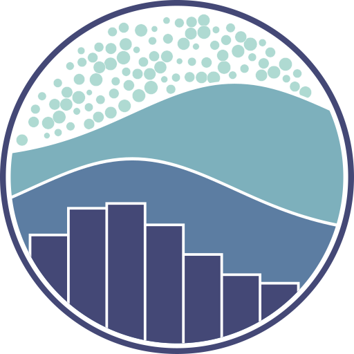
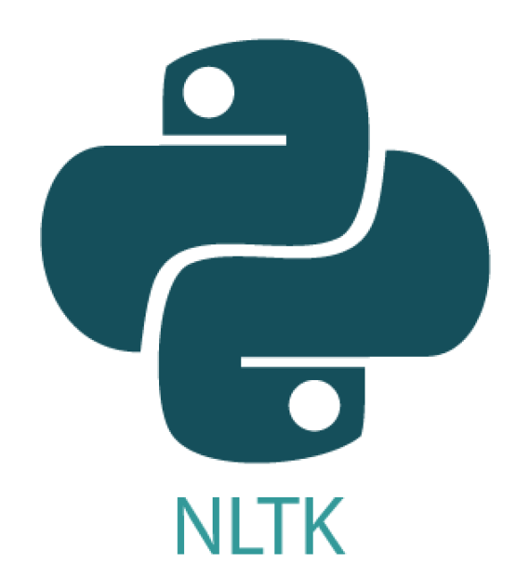
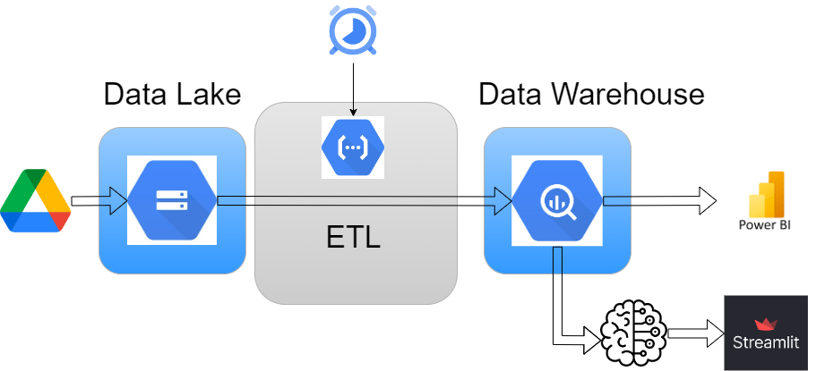

### PROYECTO   GOOGLE - YELP

#### MARCA DE LA EMPRESA

CongiCorp Solutions. Tech & Business. Consultora de analítica de negocios y aplicación de algoritmos de Machine Learning para empresas e inversionistas.

#### INTEGRANTES Y ROLES

Franco D’Auro: Data analyst. Diseño de marca.

Juan Carlos Brunello: Data engineer. Machine learning operations

Lucas Ariel Leguizamón Alegre: Data scientist.

Luis Alberto Cerelli: Data engineer.

Moisés Elías Gómez Montoya: Data scientist.

Nathaly Castro Gómez: Data analyst

#### MISIÓN

Nuestra misión es proporcionar soluciones innovadoras en ciencia de datos que transformen los datos en conocimiento valioso. Esto permite a nuestros clientes tomar decisiones estratégicas basadas en información precisa y de alta calidad, además de acceder a análisis avanzados. Nos especializamos en desbloquear el potencial de los datos mediante la inteligencia artificial y el aprendizaje automático, mejorando la eficiencia y competitividad de las organizaciones.

#### VISIÓN

Nuestra visión es convertirnos en líderes en el campo de la consultoría de ciencia de datos en los próximos cinco años. Seremos reconocidos por nuestra capacidad de anticiparnos y adaptarnos a las necesidades cambiantes del mercado. Aspiramos a ser el socio estratégico de elección para empresas que buscan una ventaja competitiva a través del análisis de datos y la inteligencia artificial. Nuestro objetivo es impulsar la innovación y el éxito a largo plazo de nuestros clientes.

#### VALORES

Innovación: Promovemos un ambiente de creatividad y exploración continua para encontrar soluciones únicas a desafíos complejos.
Integridad: Actuamos con honestidad y transparencia, construyendo relaciones de confianza con nuestros clientes y colaboradores.
Excelencia: Nos comprometemos con la calidad y la mejora continua en todos nuestros servicios y procesos.
Colaboración: Trabajamos en equipo con nuestros clientes y socios para alcanzar objetivos comunes, compartiendo conocimientos y experiencias.

#### CONTEXTO

Un importante inversor del sector de restaurantes y el ocio de los  Estados Unidos, nos ha contratado para realizar un análisis detallado de la información de los usuarios de las plataformas Yelp y Google Maps sobre restaurantes. Debemos utilizar análisis de sentimientos sobre las reseñas de estas plataformas para predecir cuáles serán los restaurantes que crecerán o decaerán. Además, determinaremos la ubicación para emplazar nuevos locales.

#### ALCANCE

El alcance de este proyecto queda restringido a los restaurantes  de California, Florida, Nueva York, Texas y Pensilvania, correspondiente al período desde 2016 hasta 2021.

#### OBJETIVOS ESPECÍFICOS 

1. Recopilar y consolidar datos:
* Extraer y limpiar datos de Yelp y Google Maps.
* Integrar estos datos en un Data Warehouse que permita el acceso eficiente y la manipulación de grandes volúmenes de información.

2. Realizar análisis de sentimientos:
* Analizar las opiniones de los usuarios utilizando técnicas de procesamiento de lenguaje natural (NLP) para determinar el sentimiento predominante (positivo, negativo o neutro) en las reseñas de los restaurantes.

3. Optimizar Ubicaciones para nuevos locales:
* Analizar datos geográficos para identificar las mejores ubicaciones para abrir nuevos establecimientos, considerando factores como la densidad de la competencia.

#### INDICADORES CLAVES DE RENDIMIENTO (KPI's)

En este caso nos basamos en intermensuales porcentuales donde 

$R_i$ = Número total de reviews del mes $i$

$PRP_i$ = Proporción de reviews positivas del mes $i$

$PRN_i$ = Proporción de Reviews Negativas del mes $i$

|Nombre|Fórmula|Meta|Interpretación|
|:-----|:-----:|:--:|:-------------|
|Cambio total de reviews|$fracc{R_i-R_{i-1}}{R_{i-1}}|$+5%$|Cambio en la visibilidad|

* Aumento de la cantidad de reviews totales en un 5% con respecto al semestre anterior por local.
* Disminución anual en la proporción de las reviews negativas en un 5% por local.
* Aumento anual en la proporción de las reviews positivas en un 5% por local.
* Disminución anual en la proporción de las reviews negativas en temporada alta (Junio, Julio y Agosto) en un 5% por local.
* Aumento anual en la proporción de las reviews positivas en temporada alta (Junio, Julio y Agosto) en un 5% por local.
* Disminución de la cantidad total de reviews del resto de locales competencia en la misma ciudad en un 5%.

#### STACK TECNOLÓGICO

### Lenguajes de Programación
Python 

### Herramientas de Control de Versiones y Colaboración
Git 
GitHub 

### Entornos de Desarrollo y Edición de Código
Visual Studio Code 
Jupyter 

### Herramientas de Análisis y Visualización de Datos
Pandas 
NumPy 
Matplotlib 
Seaborn 
Power BI 

### Herramientas de Procesamiento de Lenguaje Natural
NLTK 

### Plataformas de Computación en la Nube y Análisis de Datos
Google Cloud 
BigQuery 

### Herramientas de Orquestación y Automatización de Flujos
Google Functions 
Google Scheduler 

### Herramientas para Sistemas de Recomendación
Surprise 

### Herramientas de Desarrollo de Aplicaciones Web
Streamlit 

### Bibliotecas de Aprendizaje Automático
Scikit-learn 

### PIPELINE

Para el pipeline basicamente se ha utilizado **Google Cloud Storage** como Data Lake, donde se almacenan los datos en crudo. Para cumplir la función del Data Warehouse se ha utilizado el servicio de **Big Query**. En lo que se refiere a la orquestación se utilizo **Google Cloud Functions** para poder ejecutar los scripts para las extracciones de los archivos desde el Data Lake, transformarlos y cargarlos al Data Warehouse.

### MACHINE LEARNING

En lo referente al modelo de *Machaine Learning* se utilizó la librería Scikit Learn de donde se concluyo que el mejor modelo para esta situación es el *Random Forest Regression*.

Mediante el uso de este tipo de modelo se lograron dos productos de suma utilidad para el inversor. El primero es un modelo de **Predicción de crecimiento**, en base a una categoría seleccionada indica las ciudades donde es más probable que un negocio de dicha categoría pueda crecer. El segundo modelo es un **Identificador de oportunidades**, donde al seleccionar una ciudad y la cantidad de categorias el modelo indicará cuales serán las categorías con mayores probabilidad de exito.

### STREAMLIT

El modelo de ML se desplego en la plataforma gratuita **Streamlit** en el siguiente [enlace](https://cognicorp-gy.streamlit.app/), el mismo pesaba demasiado (alrededor de 600 MB) para ser subido a *GitHub* por lo que se almacenó en un bucket de *Cloud Storage*. 

Para tener un mejor rendimiento del modelo se solicito una expansión de los recursos provisto por la plataforma y al ser para un proyecto educativo, han aumentado a 8 GiB el limite de la memoria RAM. Para esto se completo un formulario y pasadas 24 horas se recibió la respuesta.

### DASHBOARD 

Se realizo un dashboard en *Power BI* para poder llevar a cabo un story telling para el cliente y de esa manera se puedieran llegar a las conclusiones mediante los hallazgos logrados por los analistas. Los datos de este producto son obtenidos directamente del **Data Warehouse** lo que provoca que a medida que se procesen datos se pueda volver a hacer el análisis.
